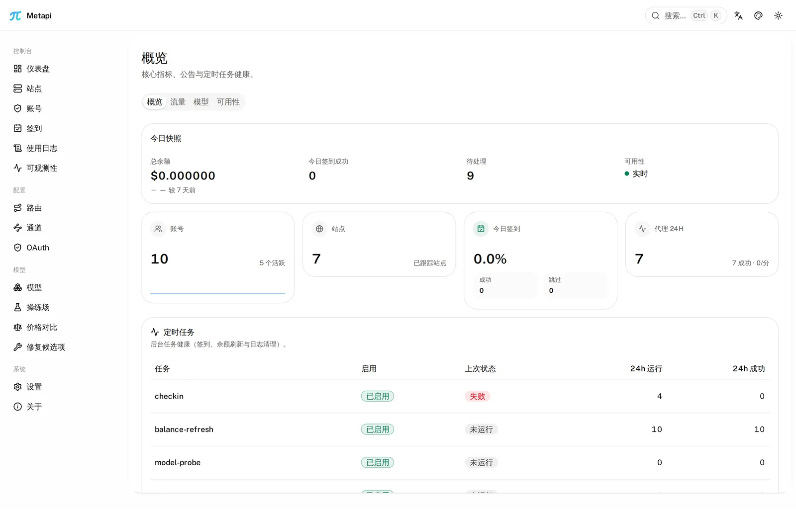
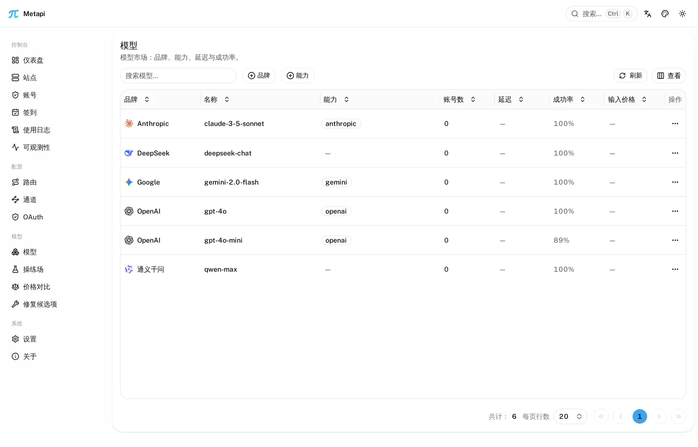
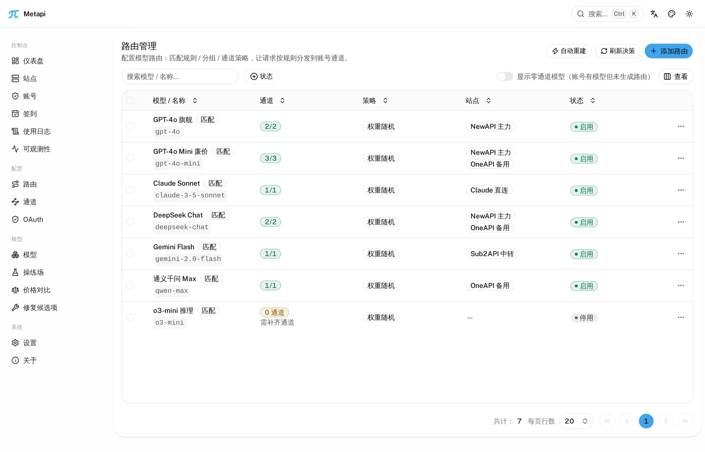
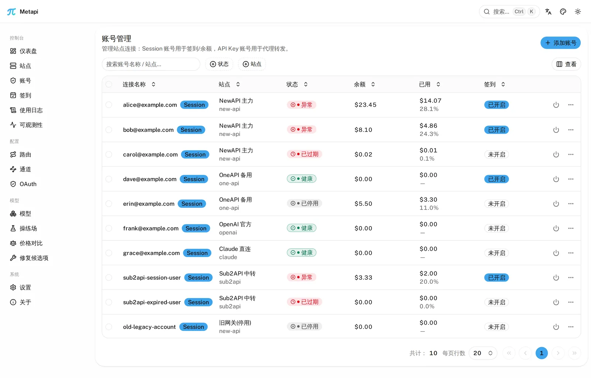
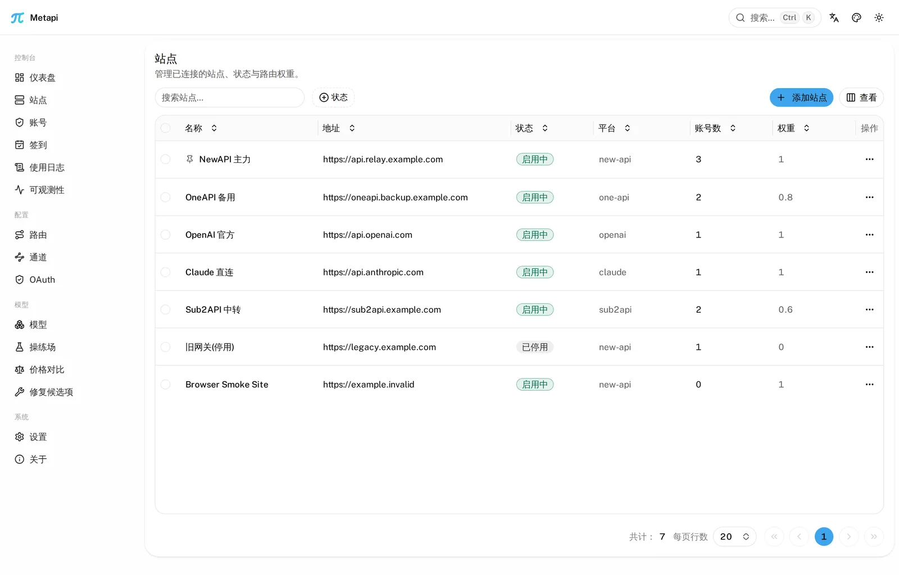
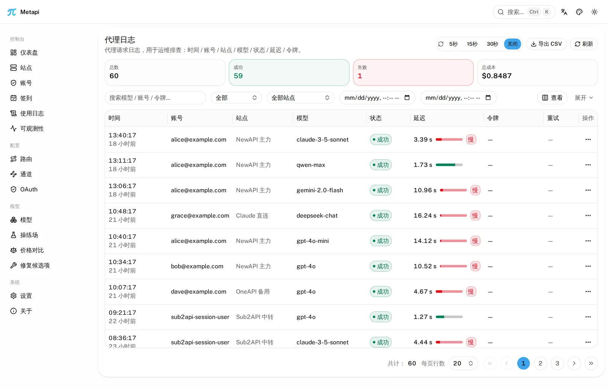
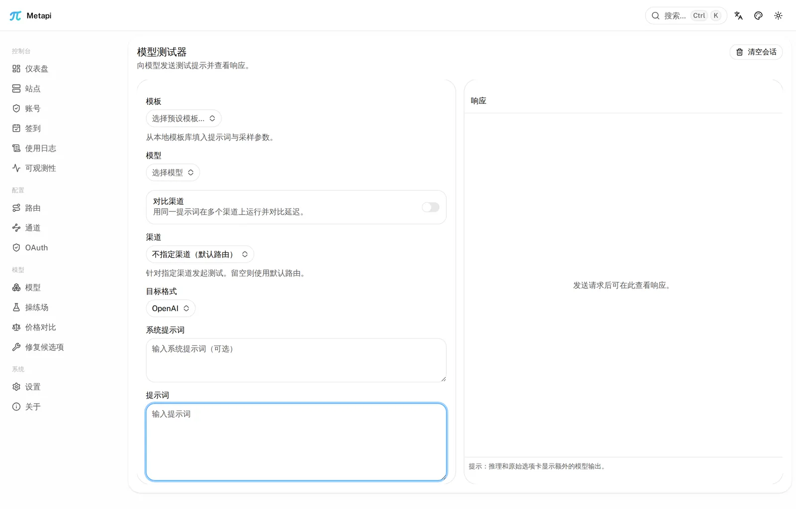
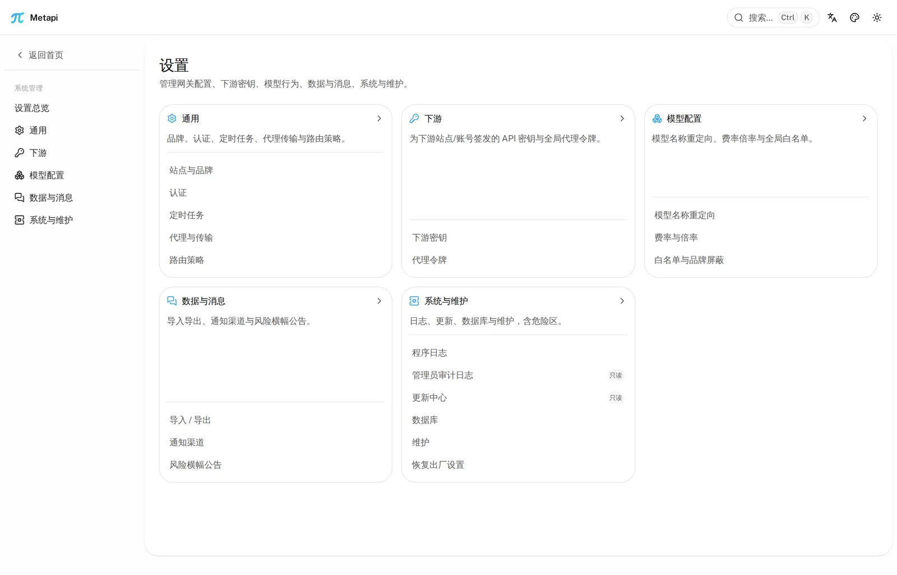

<p align="center">
  
</p>

<h1 align="center">Metapi Go</h1>

<p align="center">
  <strong>中转站的中转站 — 将分散的 AI API 站点聚合为一个统一网关</strong>
</p>

<p align="center">
  把你在各处注册的 New API / One API / OneHub / Sub2API 等站点，<br>
  汇聚成 <strong>一个 API Key、一个入口</strong>，自动发现模型、智能路由、成本最优。
</p>

<p align="center">
  <a href="README.md"><strong>中文</strong></a> ·
  <a href="README_EN.md">English</a>
</p>

<p align="center">
  <a href="https://github.com/DeliciousBuding/metapi-go/actions/workflows/main.yml"></a>
  <a href="https://github.com/DeliciousBuding/metapi-go/releases/latest"></a>
  <a href="https://github.com/DeliciousBuding/metapi-go/pkgs/container/metapi-go"></a>
  
  <a href="LICENSE"></a>
</p>

---

## 界面预览

<table>
  <tr>
    <td align="center">
      
      <div><b>仪表盘</b> — 余额分布、签到与定时任务健康</div>
    </td>
    <td align="center">
      
      <div><b>模型市场</b> — 跨站模型覆盖、品牌与实测指标</div>
    </td>
  </tr>
  <tr>
    <td align="center">
      
      <div><b>智能路由</b> — 多通道概率分配、成本优先选路</div>
    </td>
    <td align="center">
      
      <div><b>账号管理</b> — 多站点多账号、健康状态追踪</div>
    </td>
  </tr>
  <tr>
    <td align="center">
      
      <div><b>站点管理</b> — 上游站点配置与状态一览</div>
    </td>
    <td align="center">
      
      <div><b>使用日志</b> — 代理请求日志与成本明细</div>
    </td>
  </tr>
  <tr>
    <td align="center">
      
      <div><b>模型操练场</b> — 在线对比不同通道输出</div>
    </td>
    <td align="center">
      
      <div><b>系统设置</b> — 全局参数、主题与安全配置</div>
    </td>
  </tr>
</table>

---

## 介绍

现在 AI 生态里有越来越多基于 New API / One API 系列的聚合中转站，要管理多个站点的余额、模型列表和 API 密钥，往往既分散又费时。

**Metapi** 作为这些中转站之上的**元聚合层（Meta-Aggregation Layer）**，把多个站点统一到 **一个入口（可按项目配置多个下游 API Key）**——下游所有工具（Cursor、Claude Code、Codex、Open WebUI 等）即可无感接入全部模型。当前支持的上游范围：

- **聚合面板**：New API、One API、OneHub、DoneHub、Veloera、AnyRouter、Sub2API
- **通用兼容接口**：OpenAI / Claude / Gemini 兼容端点，以及 `cliproxyapi` / CPA
- **OAuth 连接**：Codex、Claude、Gemini CLI、Antigravity

| 痛点                               | Metapi 怎么解决                                          |
| ---------------------------------- | -------------------------------------------------------- |
| 每个站点一个 Key，下游工具配置一堆 | **统一代理入口 + 多下游 Key 策略**，模型自动聚合到 `/v1/*` |
| 不知道哪个站点用某个模型最便宜     | **智能路由**自动按成本、余额、使用率选最优通道           |
| 某个站点挂了，手动切换好麻烦       | **自动故障转移**，一个通道失败自动冷却并切到下一个       |
| 余额分散在各处，不知道还剩多少     | **集中看板**一目了然，余额不足自动告警                   |
| 每天得去各站签到领额度             | **自动签到**定时执行，奖励自动追踪                       |
| 不知道哪个站有什么模型             | **自动模型发现**，上游新增模型零配置出现在你的模型列表里 |

### Go 版有什么不同

这是 [Metapi（TypeScript 版）](https://github.com/cita-777/metapi) 的 Go 重写，客户端可见行为保持兼容，运行时更轻：

|             | Node.js（原版）  | Go（本版）     |
| ----------- | ---------------- | -------------- |
| 内存占用    | ~85 MB           | ~20 MB         |
| Docker 镜像 | ~250 MB          | ~15 MB         |
| 启动时间    | 5-10 秒          | 即时           |
| 部署方式    | 需要 Node 运行时 | 单个二进制文件 |

---

## 快速开始

### Docker（推荐）

```bash
docker run -d --name metapi \
  -p 4000:4000 \
  -e AUTH_TOKEN=your-admin-token \
  -e PROXY_TOKEN=your-proxy-sk-token \
  -e TZ=Asia/Shanghai \
  -v ./data:/app/data \
  --restart unless-stopped \
  ghcr.io/deliciousbuding/metapi-go:latest
```

启动后访问 `http://localhost:4000`，用 `AUTH_TOKEN` 登录即可。

> [!IMPORTANT]
> 请务必修改 `AUTH_TOKEN` 和 `PROXY_TOKEN`，不要使用默认值。数据存储在 `./data` 目录，升级不会丢失。

### Docker Compose

```bash
mkdir metapi && cd metapi

cat > docker-compose.yml << 'EOF'
services:
  metapi:
    image: ghcr.io/deliciousbuding/metapi-go:latest
    ports:
      - "4000:4000"
    volumes:
      - ./data:/app/data
    environment:
      AUTH_TOKEN: ${AUTH_TOKEN:?AUTH_TOKEN is required}
      PROXY_TOKEN: ${PROXY_TOKEN:?PROXY_TOKEN is required}
      CHECKIN_CRON: "0 8 * * *"
      BALANCE_REFRESH_CRON: "0 * * * *"
      PORT: ${PORT:-4000}
      DATA_DIR: /app/data
      TZ: ${TZ:-Asia/Shanghai}
    restart: unless-stopped
EOF

export AUTH_TOKEN=your-admin-token
export PROXY_TOKEN=your-proxy-sk-token
docker compose up -d
```

Compose、反向代理、PostgreSQL 与升级细节见 [部署指南](docs/deployment.md)；从安装到发出第一个代理请求的完整 walkthrough 见 [快速上手](docs/getting-started.md)。

### 从源码

```bash
git clone https://github.com/DeliciousBuding/metapi-go.git
cd metapi-go
go build -o metapi ./cmd/server
AUTH_TOKEN=your-admin-token PROXY_TOKEN=your-proxy-sk-token ./metapi
```

Windows 本地运行且未设置 `HOST` 时，默认仅监听 `127.0.0.1`，避免反复触发入站防火墙提示；需要局域网访问时显式设置 `HOST=0.0.0.0`。

---

## 第一个代理请求

登录后在「下游密钥」里创建一把 Key（或直接使用 `PROXY_TOKEN`），然后像调用 OpenAI 一样调用 Metapi：

```bash
curl http://localhost:4000/v1/chat/completions \
  -H "Authorization: Bearer $PROXY_TOKEN" \
  -H "Content-Type: application/json" \
  -d '{
    "model": "claude-3-5-sonnet",
    "messages": [{ "role": "user", "content": "hello" }]
  }'
```

Metapi 会自动在所有上游站点中选择成本最优、状态健康的通道；失败时自动冷却该通道并重试下一个。Claude 原生格式（`/v1/messages`）、Responses、Embeddings、Images、`/v1/models` 与 `/v1/files` 同样支持，完整端点清单见 [HTTP API](docs/api.md)，客户端接入（Cursor / Claude Code / Codex / Open WebUI）见 [客户端接入](docs/client-integration.md)。

---

## 核心功能

### 统一代理网关

兼容 **OpenAI** 与 **Claude** 下游格式，对接所有主流客户端。支持 Chat Completions、Responses、Messages、Completions（Legacy）、Embeddings、Images、Models，以及标准 `/v1/files` 文件接口。完整的 SSE 流式传输，自动格式转换（OpenAI ⇄ Claude）。

### 智能路由引擎

- 自动发现所有上游站点的可用模型，**零配置**生成路由表
- 四级成本信号：实测成本 → 账号配置成本 → 目录参考价（models.dev）→ 默认兜底
- 多通道概率分摊，基于成本、余额、使用率加权分配
- 失败通道自动冷却与避让，请求失败自动重试切到其他可用通道
- 运行时熔断器 + half-open 探测，恢复中的通道可受控重新进入候选集

### 多平台聚合管理

| 平台                     | 适配器                          | 说明                 |
| ------------------------ | ------------------------------- | -------------------- |
| New API                  | `new-api`                       | 新一代大模型网关     |
| One API                  | `one-api`                       | 经典 OpenAI 接口聚合 |
| OneHub                   | `onehub`                        | One API 增强分支     |
| DoneHub                  | `done-hub`                      | OneHub 增强分支      |
| Veloera                  | `veloera`                       | API 网关平台         |
| AnyRouter                | `anyrouter`                     | 通用路由平台         |
| Sub2API                  | `sub2api`                       | 订阅制中转平台       |
| OpenAI / Claude / Gemini | `openai` / `claude` / `gemini`  | 标准兼容接口         |

共 **16** 个适配器，覆盖模型枚举、余额查询、Token 管理、代理接入等通用能力；登录、签到、用户信息等能力按平台而异。

### 账号与 Token 管理

多站点多账号，每个账号可持有多个 API Token。`healthy` / `unhealthy` / `degraded` / `disabled` 四级状态机；凭证加密存储在本地数据库中；Token 过期自动重新登录获取新凭证；禁用站点自动级联禁用所有关联账号。

### 模型广场与操练场

跨站模型覆盖总览：哪些模型可用、多少账号覆盖、各站定价对比；延迟与成功率实测指标；交互式模型操练场可强制指定通道对比输出，保留真实状态与延迟。

### 自动签到与余额

Cron 定时签到（默认每日 08:00），智能解析奖励金额，失败自动通知，并发锁防重复；定时余额刷新（默认每小时），收入追踪与每日/累计消费趋势分析。

### 告警通知

九种通知渠道：Webhook、Bark、Server酱、Telegram Bot、SMTP 邮件、飞书（HMAC 加签）、钉钉（HMAC 加签）、企业微信、ntfy。告警场景覆盖余额不足、站点/账号异常、签到失败、代理请求失败、Token 过期与每日摘要，可按类型逐项静音，冷却机制防重复通知。

### 运营与审计

管理操作审计日志（写入留痕）；实时 QPS / 成功率运维面板（WebSocket 推流、断线自动重连）；批量模型验证、模型倍率总览与行内编辑、模型重定向映射、账号/站点标签；仪表盘快照 PNG 导出。

### 轻量部署

单 Docker 容器 + 本地数据目录即可运行，也可外接 PostgreSQL；SQLite 与 PostgreSQL 双 dialect，启动自动执行幂等 schema 升级。Go 单二进制，~15 MB 镜像，启动即时。数据完整导入导出，迁移无忧。

---

## 配置

只需两个必填环境变量即可启动：

| 变量         | 说明                          |
| ------------ | ----------------------------- |
| `AUTH_TOKEN` | 管理后台登录令牌              |
| `PROXY_TOKEN`| 下游客户端调用 `/v1/*` 的 Key |

其余常用项：

| 变量                 | 默认值      | 说明                          |
| -------------------- | ----------- | ----------------------------- |
| `PORT`               | `4000`      | 监听端口                      |
| `HOST`               | 平台相关    | Windows 默认 `127.0.0.1`，其他 `0.0.0.0`；容器固定 `0.0.0.0` |
| `DATABASE_URL`       | 空          | PostgreSQL 连接串；留空使用 SQLite |
| `CHECKIN_CRON`       | `0 8 * * *` | 签到时间                      |
| `BALANCE_REFRESH_CRON` | `0 * * * *` | 余额刷新频率                |

完整环境变量清单（含 PostgreSQL 池预设、代理限额、CORS、可信代理 CIDR 等）见 [配置参考](docs/configuration.md) 与 [`.env.example`](.env.example)。

### 运维健康检查

- `GET /health`：liveness，只确认 HTTP 进程存活
- `GET /ready`：readiness，检查数据库；不可用或关停中返回 503
- Docker 默认执行 `metapi healthcheck`，等价探测 `http://127.0.0.1:${PORT}/ready`

---

## 从 TypeScript 版迁移

数据库 Schema 完全一致，Go 版启动时自动执行幂等迁移：停止旧服务，用同样的环境变量启动 Go 版即可，`./data` 目录原样复用。使用 MySQL 的部署需先经 `metapi-migrate` 工具迁到 PostgreSQL。完整步骤与回滚方案见 [迁移指南](docs/migration.md)。

---

## 文档导航

| 文档                                             | 用途                                  |
| ------------------------------------------------ | ------------------------------------- |
| [docs/getting-started.md](docs/getting-started.md)     | **快速上手**：安装到第一个代理请求    |
| [docs/deployment.md](docs/deployment.md)               | 部署 / 反向代理 / PostgreSQL          |
| [docs/configuration.md](docs/configuration.md)         | 环境变量完整参考                      |
| [docs/client-integration.md](docs/client-integration.md) | 客户端接入（Cursor / Claude Code / Codex / Open WebUI） |
| [docs/api.md](docs/api.md)                             | HTTP API 端点清单                     |
| [docs/migration.md](docs/migration.md)                 | TS → Go / SQLite → PG 迁移            |
| [docs/faq.md](docs/faq.md)                             | 常见问题                              |
| [docs/architecture.md](docs/architecture.md)           | 包结构与请求路径（开发者）            |
| [docs/README.md](docs/README.md)                       | 文档地图（含维护者文档索引）          |
| [CHANGELOG.md](CHANGELOG.md)                           | 版本变更                              |

---

## 开发

### 后端（Go）

```bash
make build    # 构建
make test     # 运行全部测试（含 -race）
make vet      # go vet
make lint     # golangci-lint
make vuln     # govulncheck 漏洞扫描
```

### 前端（`web/`，Bun）

```bash
cd web
bun install
bun run dev         # 本地开发（/api /v1 代理到后端 :4000）
bun run typecheck   # tsgo 类型检查
bun run test        # vitest 全量
bun run build       # rsbuild 构建（产物经 go:embed 打包进 Go 二进制）
```

贡献流程（分支模型、PR 门禁）见 [CONTRIBUTING.md](CONTRIBUTING.md)。

---

## 贡献与安全

- [CONTRIBUTING.md](CONTRIBUTING.md) — 分支模型、PR 流程、本地门禁
- [SECURITY.md](SECURITY.md) — 漏洞报告（Security Advisory）
- [CODE_OF_CONDUCT.md](CODE_OF_CONDUCT.md) — 社区行为准则

---

## 相关项目

- [Metapi (TypeScript)](https://github.com/cita-777/metapi) — 原版 Node.js 实现，本项目为其 Go 重写
- [New API](https://github.com/QuantumNous/new-api) — 主要上游之一
- [One API](https://github.com/songquanpeng/one-api) — 经典 OpenAI 接口聚合

---

## 隐私说明

Metapi 完全自托管：所有数据（账号、令牌、路由、日志）存储在你自己的部署环境中，不向任何第三方上报；代理请求仅在你的服务器与上游站点之间直连传输。

---

## 许可证

[MIT](LICENSE)
