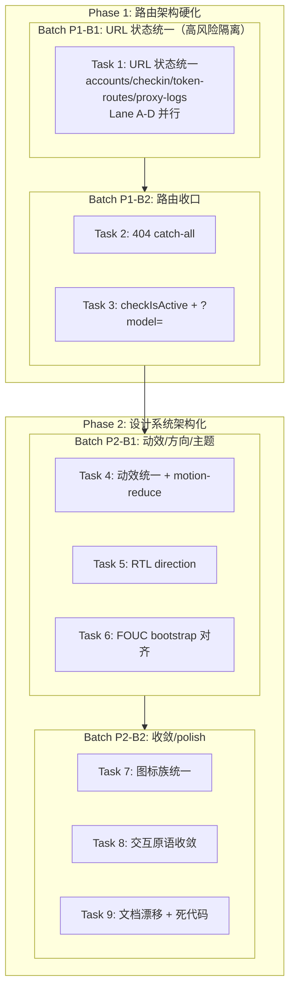

# Task Dependency Graph

```mermaid
graph TD
    subgraph Phase1 [Phase 1: 路由架构硬化]
        subgraph P1B1 [Batch P1-B1: URL 状态统一（高风险隔离）]
            T1[Task 1: URL 状态统一<br/>accounts/checkin/token-routes/proxy-logs<br/>Lane A-D 并行]
        end
        subgraph P1B2 [Batch P1-B2: 路由收口]
            T2[Task 2: 404 catch-all]
            T3[Task 3: checkIsActive + ?model=]
        end
    end

    subgraph Phase2 [Phase 2: 设计系统架构化]
        subgraph P2B1 [Batch P2-B1: 动效/方向/主题]
            T4[Task 4: 动效统一 + motion-reduce]
            T5[Task 5: RTL direction]
            T6[Task 6: FOUC bootstrap 对齐]
        end
        subgraph P2B2 [Batch P2-B2: 收敛/polish]
            T7[Task 7: 图标族统一]
            T8[Task 8: 交互原语收敛]
            T9[Task 9: 文档漂移 + 死代码]
        end
    end

    P1B1 --> P1B2
    P1B2 --> P2B1
    P2B1 --> P2B2
```

> Phase 1 → 2 是顺序隔离（无硬依赖），但 T1（URL 迁移）改的是页面数据流，先落地可降低后续动效/图标改动的回归面。批内无互斥依赖。
